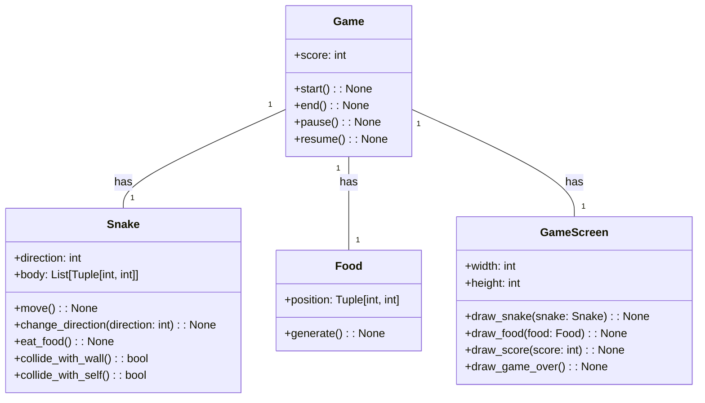
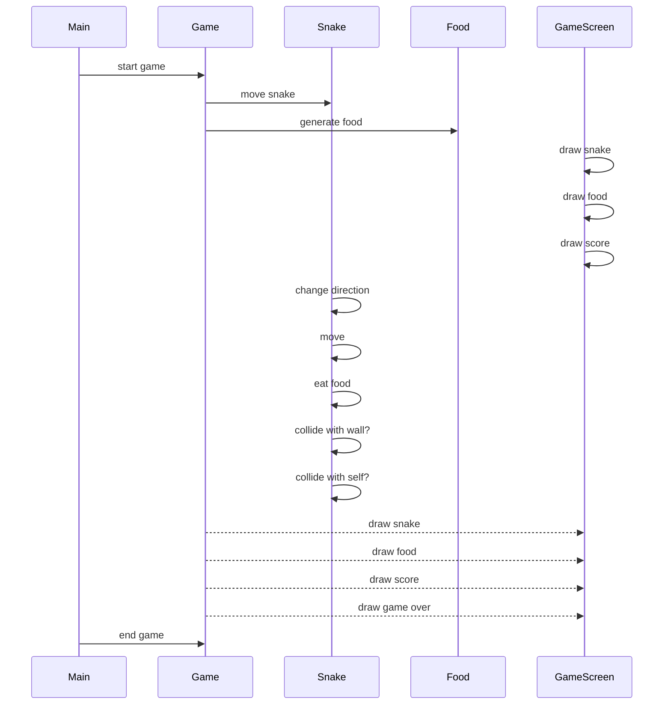

## Implementation approach
We will use the Pygame library to develop the snake game. Pygame is a popular open-source library for creating games in Python and provides a range of functionality for handling graphics, input, and sound. It is well-documented and has a large community, making it a suitable choice for this project.

## Python package name
```python
"snake_game"
```

## File list
```python
[
    "main.py",
]
```

## Data structures and interface definitions


## Program call flow


## Anything UNCLEAR
There are no unclear points.