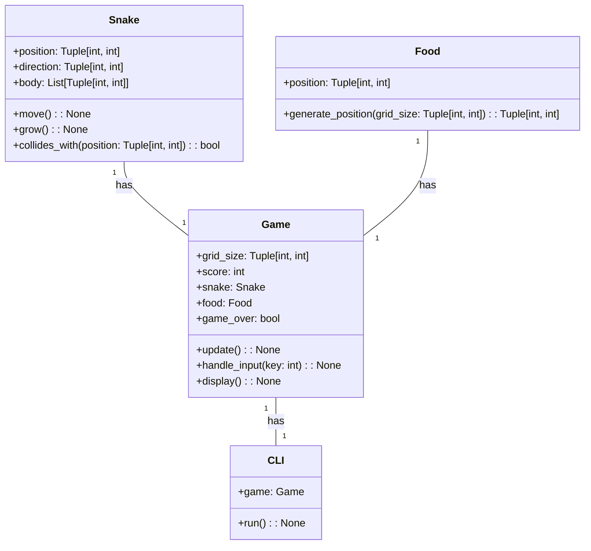
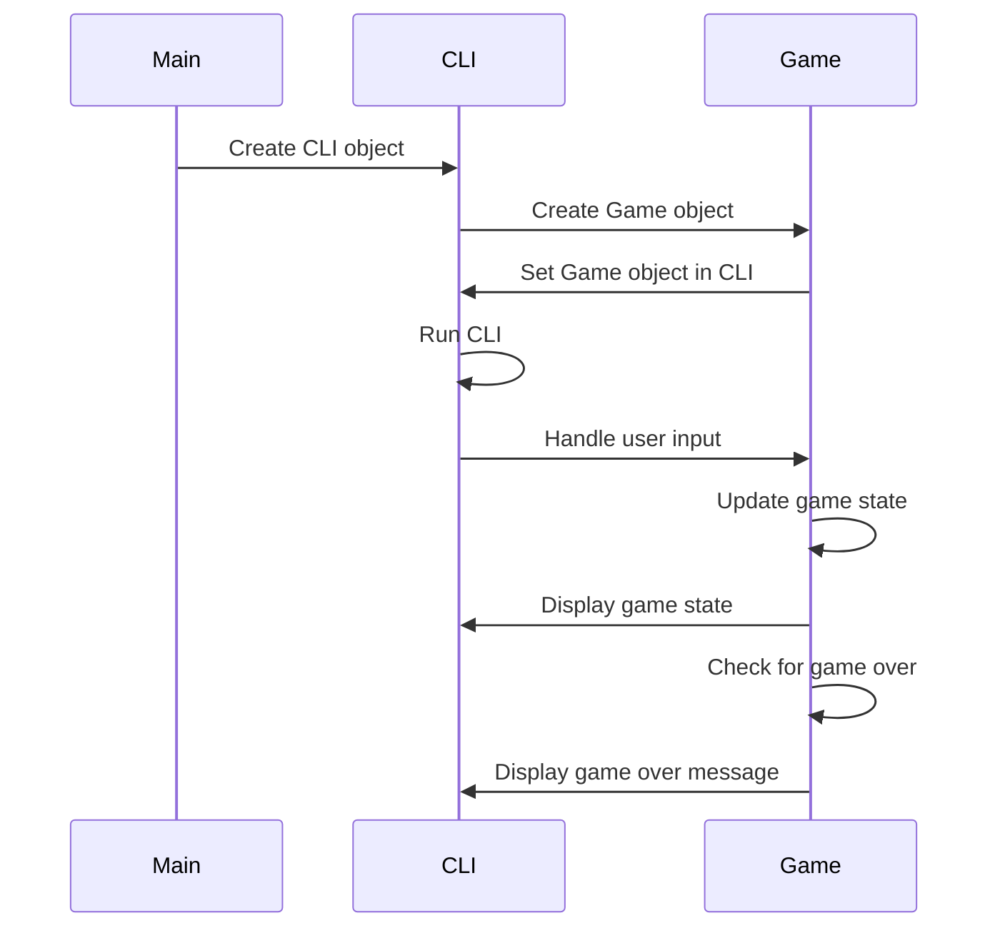

## Implementation approach
We will use the following open-source frameworks and libraries to implement the snake game:

1. Pygame: Pygame is a popular library for creating games in Python. It provides functionality for handling graphics, sound, and user input, which are essential for creating an interactive game like snake.

2. curses: The curses library provides a terminal-independent way of creating text-based interfaces in Python. It allows us to control the cursor position, handle keyboard input, and display text in a terminal window. We can use curses to create the command line interface for our snake game.

By combining Pygame for the game logic and graphics and curses for the command line interface, we can create a snake game that can be played in the command line interface with a user-friendly and intuitive interface.

## Python package name
```python
"snake_game"
```

## File list
```python
[
    "main.py",
    "snake.py",
    "food.py",
    "game.py"
]
```

## Data structures and interface definitions


## Program call flow


## Anything UNCLEAR
There are no unclear points.