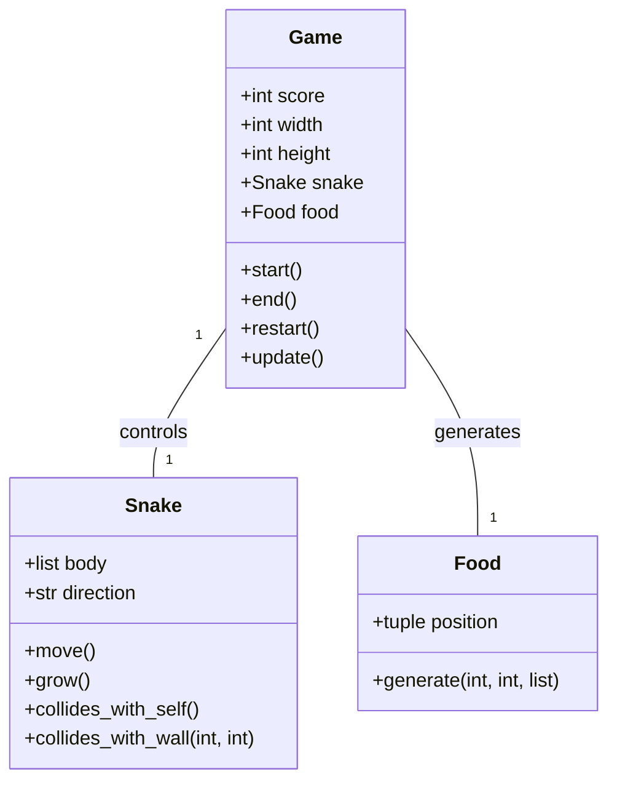
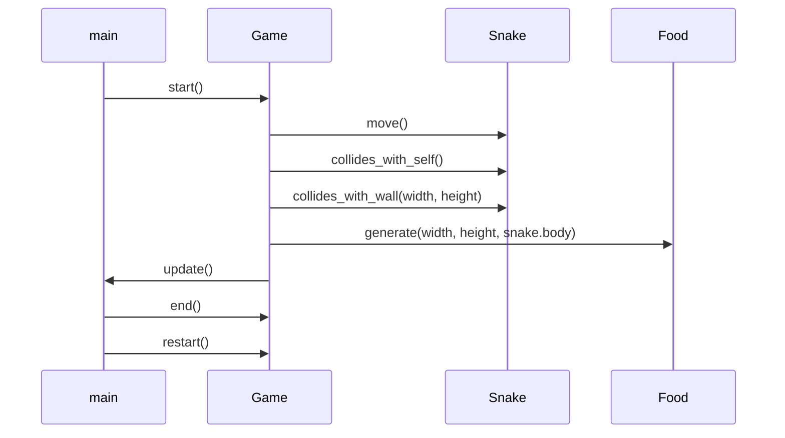

## Implementation approach
We will use the curses library in Python, which provides methods for creating text-based user interfaces. The main challenges will be to handle the snake's movement and growth, generate food randomly, and detect collisions with the wall or the snake's own body. 

The snake will be represented as a list of coordinates, with the head of the snake being the first element. This will allow us to easily grow the snake by appending a new coordinate to the end of the list, and move the snake by adding a new head and removing the last element.

Food will be generated randomly within the grid, excluding the cells occupied by the snake. We will need to keep track of the snake's coordinates to ensure that the food does not appear on the snake.

Collisions will be detected by checking if the new head of the snake is either outside the grid or in a cell occupied by the snake's body.

The score will be incremented each time the snake eats food and displayed on the screen. The game will end and a game over message will be displayed when a collision is detected. The player will then be given the option to restart the game.

## Python package name
```python
"snake_cli_game"
```

## File list
```python
[
    "main.py",
    "game.py",
    "snake.py",
    "food.py"
]
```

## Data structures and interface definitions


## Program call flow


## Anything UNCLEAR
The requirement is clear to me.