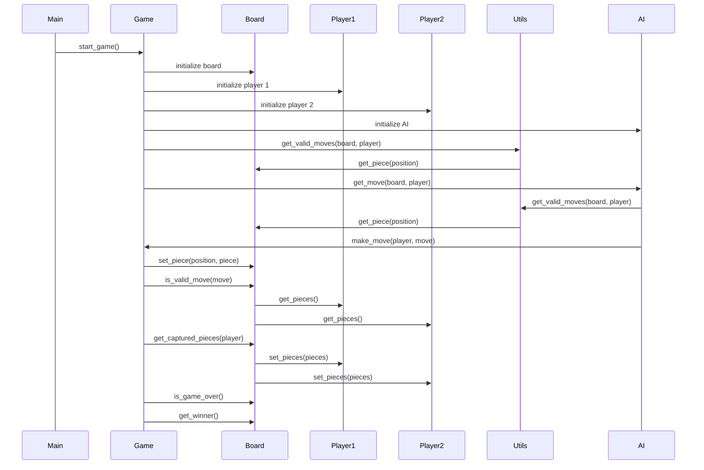

## Implementation approach:
I will use the Pygame library to create the gokumu game. Pygame is a popular open-source framework for game development in Python. It provides a set of tools and functions for creating 2D games and handling user input, graphics, and sound.

## Python package name:
```python
"gokumu_game"
```

## File list:
```python
[
    "main.py",
    "game.py",
    "board.py",
    "piece.py",
    "player.py",
    "ai.py",
    "utils.py"
]
```

## Data structures and interface definitions:
```mermaid
classDiagram
    class Game{
        -Board board
        -Player player1
        -Player player2
        -bool game_over
        +start_game()
        +make_move(player: Player, move: Move) : bool
        +is_game_over() : bool
        +get_winner() : Optional[Player]
    }

    class Board{
        -List[List[Optional[Piece]]] grid
        +get_piece(position: Tuple[int, int]) : Optional[Piece]
        +set_piece(position: Tuple[int, int], piece: Optional[Piece])
        +is_valid_move(move: Move) : bool
        +get_captured_pieces(player: Player) : int
    }

    class Piece{
        -Player owner
        +get_owner() : Player
        +get_type() : str
    }

    class Player{
        -str name
        -List[Piece] pieces
        +get_name() : str
        +get_pieces() : List[Piece]
        +set_pieces(pieces: List[Piece])
    }

    class AI{
        +get_move(board: Board, player: Player) : Move
    }

    class Move{
        -Tuple[Tuple[int, int], Tuple[int, int]] positions
        +get_positions() : Tuple[Tuple[int, int], Tuple[int, int]]
    }

    class Utils{
        +get_valid_moves(board: Board, player: Player) : List[Move]
    }

    Game "1" -- "1" Board: has
    Game "2" -- "1" Player: has
    Game "1" -- "1" AI: uses
    Board "1" -- "1" Piece: has
    Player "1" -- "1..*" Piece: has
    AI "1" -- "1" Board: uses
    Utils "1" -- "1" Board: uses
]
```

## Program call flow:


## Anything UNCLEAR:
The requirements are clear to me.