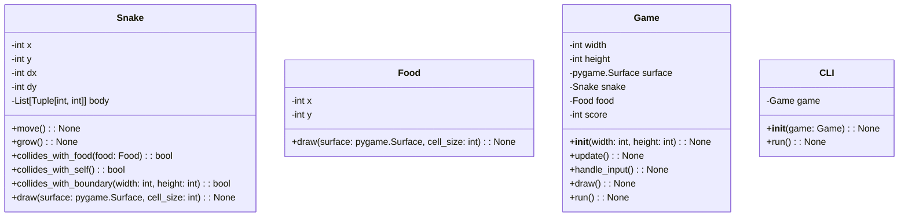
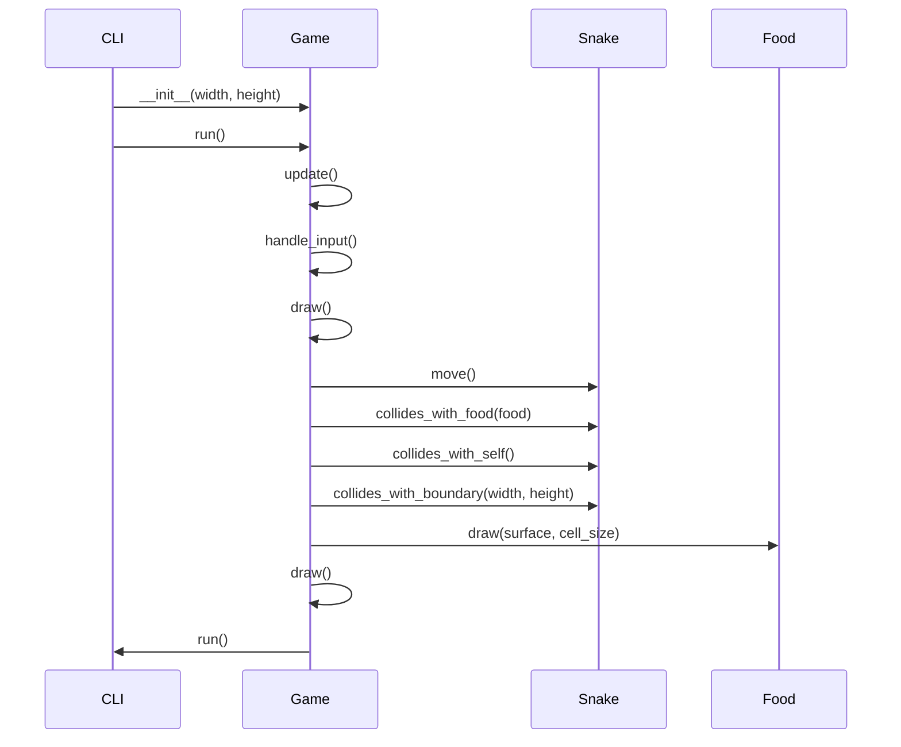

## Implementation approach

The implementation approach for the snake game will involve using the Pygame library for game logic and graphics, and the curses library for the command line interface. 

## Python package name

"snake_game"

## File list

- main.py
- snake.py
- food.py
- game.py

## Data structures and interface definitions

## Program call flow

## Anything UNCLEAR

There are no unclear points in the requirements.